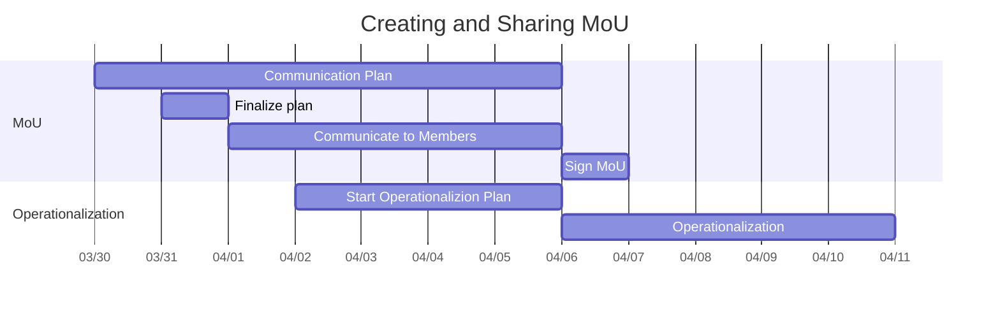

# Finalizing Lionsberg+OGM MoU

## Creating and Sharing MoU

*living timeline, dates subject to change*

- mapping on [Miro board](https://miro.com/app/board/o9J_lORD1MI=/)
    - created on 3/21
    - Jerry and Charles to populate more (when?)
- collaborate on the MoU on the regular Stewardship Council Jam Sesh call (3/23)
- synchronize the MoU with Jordan (iterate until everybody's happy) (3/24 jerry, 3/25 team)
- start Communication Plan on the regular Stewardship Council Jam Sesh call (3/30)
- Jordan, Jerry, Charles, Pete to finalize in meetings with Lionsberg General Counsel (duration: 3/24-4/6 )
- start Operationalization Plan (tbd)
- finalize [[Communicating Lionsberg Process to OGM]] plan (3/31)
- communicate with OGM members at large (duration 3/31-4/5)

## Due Diligence Around Steward Ownership
- do a short tour of other possible models
- does a 501(c)3 create a bunch of paperwork, more than we can do?

## Due Diligence Around Lionsberg

## Agreeing Collectively to Take Responsibility for MoU Commitments 

## Finalize and Sign MoU
- Jordan to grab OFC values and alignment section and insert
	- Pete to give Jordan a DOCX and Jordan to give back
- meet with Lionsberg General Counsel
- sign document with Lionsberg (4/6)

## Follow-On Action Items / Plans

- Discuss who/how many are quorum for which classes of decisions, for when we need to make definite decisions, potentially more frequently than once per week. (Bootstrap governance / Governance Plan)
- Start OGM Program/Project Management Tool Decision Plan (between Massive, Notion, Airtable, + whatever else).
- Decide how/when to move most Stewardship operations back into the public channels rather than Inner Circle.

## Infrastructure for MoU Work

- ~~create Inner Circle Stewards Wiki~~
- get team members up on Obsidian and connected to OGM Wiki
    - ~~Jerry~~
    - Charles
    - Judy
    - anybody else?
- Miro board
- [[Communicating Lionsberg Process to OGM]]